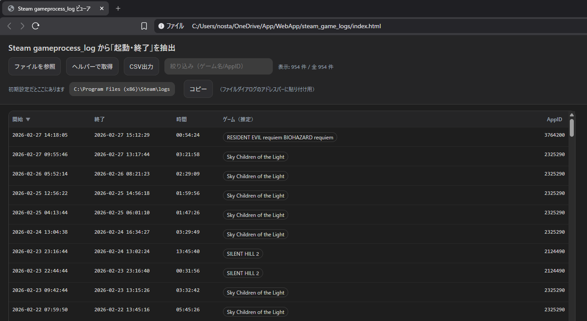

# Steam-gameprocess_log-viewer  
Steamのゲーム起動と終了の履歴を確認するためのWebツール。  
日記などをつけたい方向けのニッチなアイテムです。  
情報はご自身のローカルストレージに保存されます。  

# 公開ページ
https://qk777.github.io/Steam-gameprocess_log-viewer/
    
    
  
# 使い方
1.公開ページのURLまたはhtmlをダウンロードしてブラウザで開う。  
  
2.「ファイルを参照」またはgameprocess_log.txtをドラッグ＆ドロップする。  
　  初期設定では　C:\Program Files (x86)\Steam\logs　にある。  
  
3.起動/終了ログが表示されるので上のタブでソートする。  
      
- 「ヘルパーで取得」に関して  
現状ダウンロードしてローカル環境で動かす場合のみ利用可能です。  
SteamLogHelper.exeを起動した状態でボタンを押すだけでgameprocess_log.txtが開かれます。  
 
